[← Volver al README](../README.md)

# Cómo obtener los certificados de ARCA (testing y producción)

Para que arcli pueda hablar con ARCA necesitás un certificado y una clave privada por
entorno (`cert.testing`/`key.testing` para homologación, `cert.produccion`/`key.produccion`
para real). Esta guía muestra paso a paso cómo generarlos, con capturas del portal de
ARCA.

> Contenido adaptado de los tutoriales de [afipts.com](https://www.afipts.com) (ver
> [fuentes](#fuentes) al final). Las capturas son de ese sitio; los pasos y comandos
> están reescritos y verificados para esta guía.

## Antes de empezar

- Necesitás tu Clave Fiscal (nivel de seguridad 3) para entrar al portal de ARCA.
- Necesitás `openssl`. En Linux y macOS ya viene instalado; en Windows lo bajás de
  [slproweb.com/products/Win32OpenSSL.html](https://slproweb.com/products/Win32OpenSSL.html)
  y agregás la carpeta `bin` a tu `PATH` (o abrís la consola directamente desde ahí).
- El flujo de **habilitar el administrador de certificados** es idéntico en testing y en
  producción — lo único que cambia es a qué aplicación te lleva al final. Si ya lo hiciste
  para un entorno, repetís los mismos pasos eligiendo el otro servicio.

---

## Testing (homologación)

### 1. Habilitar el administrador de certificados

1. Entrá al portal de ARCA con tu Clave Fiscal y buscá **"Administrador de Relaciones de
   Clave Fiscal"**.

   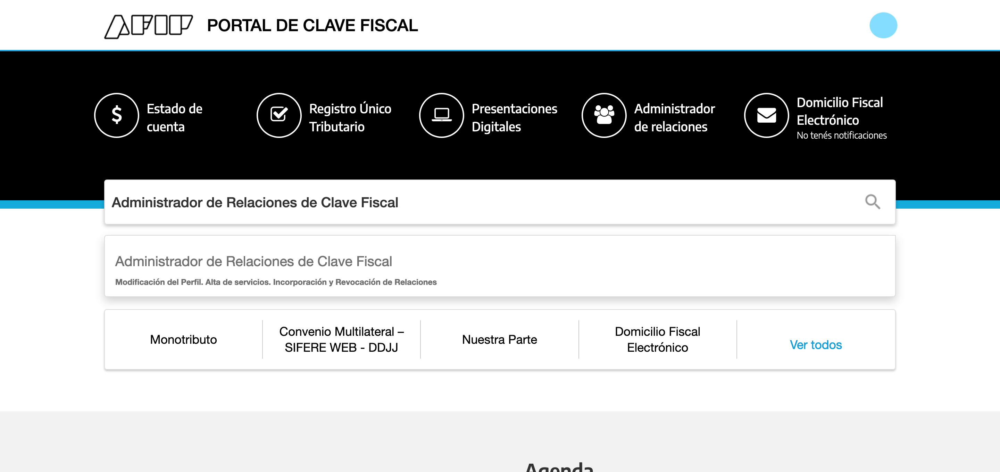

2. Elegí el contribuyente a administrar. En pruebas, usá tu propio usuario para no
   confundirte con datos de otra persona.

   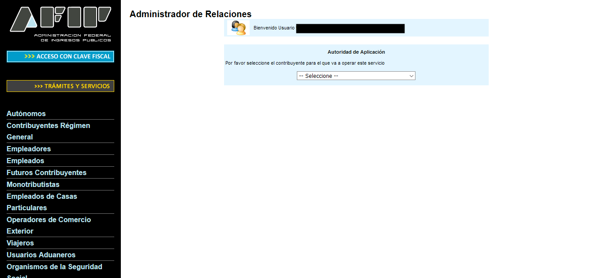

3. Elegí **"Adherir Servicio"**.

   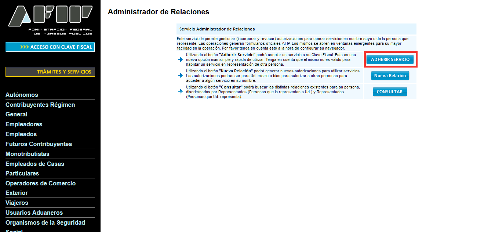

4. Buscá **ARCA → Servicios Interactivos → Administración de Certificados Digitales** en
   la lista y seleccionalo.

   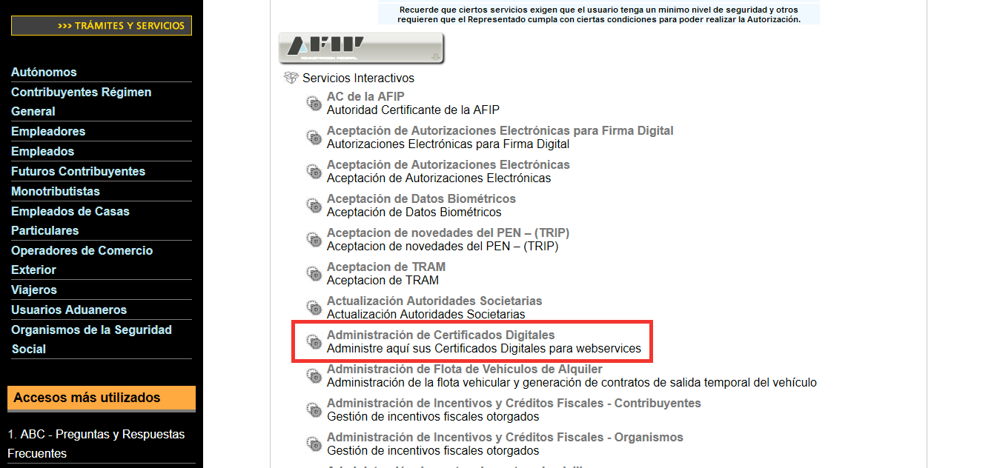

5. Confirmá la relación.

   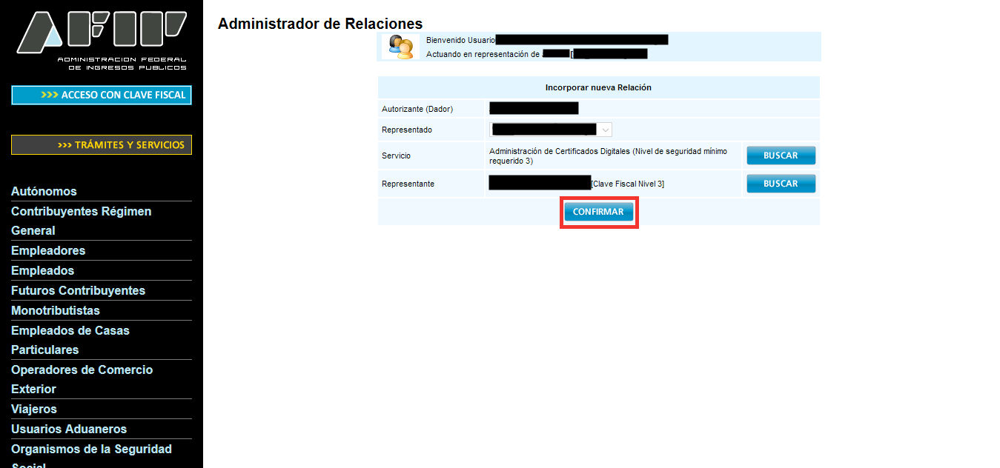

### 2. Generar la clave y el certificado

Generá la clave privada (2048 bits como mínimo) y guardala en un lugar seguro — es la
"contraseña" del certificado, si la perdés tenés que empezar de nuevo:

```bash
openssl genrsa -out testing.key 2048
```

Con esa clave, generá el CSR (Certificate Signing Request). Reemplazá `[empresa]`,
`[nombre]` y `[CUIT]` por tus datos (en pruebas, podés usar los tuyos):

```bash
openssl req -new -key testing.key -subj "/C=AR/O=[empresa]/CN=[nombre]/serialNumber=CUIT [CUIT]" -out testing.csr
```

Ahora entrá a **WSASS - Autoservicio de Acceso a WebServices (Testing/Homologación)**
desde el escritorio de ARCA (llegaste ahí en el paso anterior) y elegí **"Nuevo
Certificado"**:

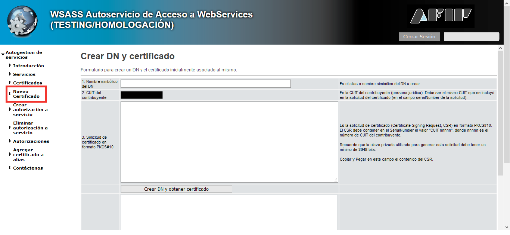

Completá:

1. **Nombre simbólico del DN**: un alias para identificar este certificado (ej. `Test1`).
2. **CUIT del contribuyente**: ya viene completo.
3. **Solicitud de certificado**: pegá el contenido completo de `testing.csr` (abrilo con
   un editor de texto).

Presioná **"Crear DN y obtener certificado"** y copiá el certificado que aparece en el
recuadro de resultado a un archivo (ej. `testing.crt`):

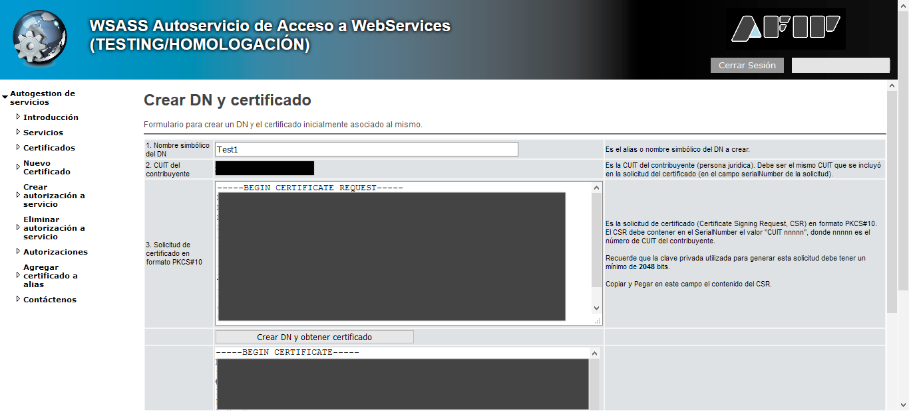

Ya no necesitás el CSR, podés borrarlo. Guardá `testing.key` y `testing.crt` — son los que
vas a usar en arcli.

### 3. Autorizar el servicio web

El certificado por sí solo no alcanza: hay que autorizarlo explícitamente a usar el
servicio web que te interesa (por ejemplo `wsfe`, facturación electrónica). Dentro de
WSASS, elegí **"Crear autorización a servicio"**:

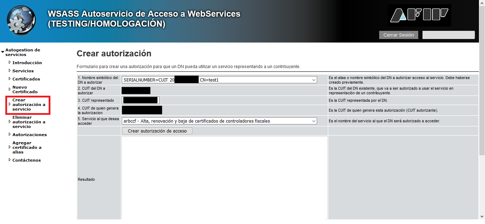

Completá:

1. **Nombre simbólico del DN a autorizar**: el alias que creaste antes (ej. `Test1`).
2. **CUIT representado**: en pruebas, tu propio CUIT.
3. **Servicio al que deseas acceder**: `wsfe` para facturación electrónica.

Presioná **"Crear autorización de acceso"** — deberías ver un mensaje `OK. Autorización
fue creada`:

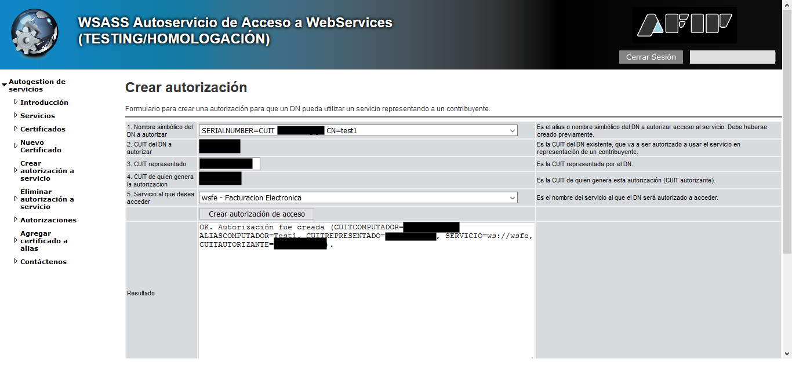

Podés verificarlo entrando a la sección **"Autorizaciones"**:

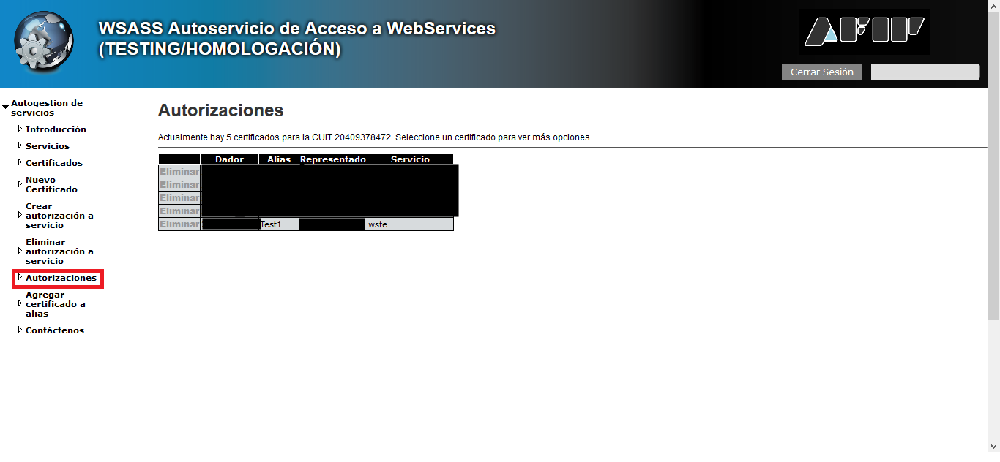

### 4. Configurar arcli

```bash
arcli config establecer cert.testing /ruta/a/testing.crt
arcli config establecer key.testing /ruta/a/testing.key
arcli config revisar --testing
```

---

## Producción

Repetí el mismo flujo, con dos diferencias: la aplicación para generar el certificado no
es WSASS sino **"Administración de Certificados Digitales"**, y la autorización del
servicio web se hace desde el Administrador de Relaciones en vez de WSASS.

### 1. Habilitar el administrador de certificados

Son los mismos 5 pasos que en testing (sección anterior), eligiendo el mismo servicio
**Administración de Certificados Digitales** para tu usuario en producción.

### 2. Generar la clave y obtener el certificado

Mismos comandos de `openssl` que en testing, con un archivo distinto:

```bash
openssl genrsa -out produccion.key 2048
openssl req -new -key produccion.key -subj "/C=AR/O=[empresa]/CN=[nombre]/serialNumber=CUIT [CUIT]" -out produccion.csr
```

Entrá a **"Administración de Certificados Digitales"** desde el escritorio de ARCA y
elegí **"Agregar alias"**:

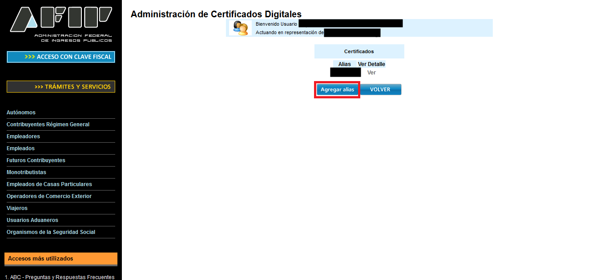

Completá el **Alias** y subí el archivo `produccion.csr` con **"Examinar..."**:

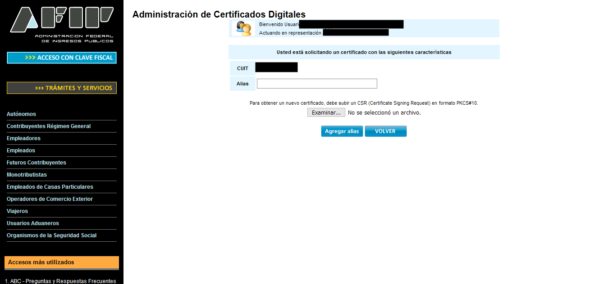

Confirmá con **"Agregar Alias"**. En la lista de certificados, hacé clic en **"Ver"** para
tu alias:

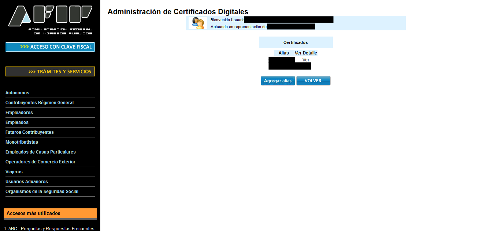

Y descargá el certificado desde el ícono de descarga (columna **Descargar**, estado
`VALIDO`):

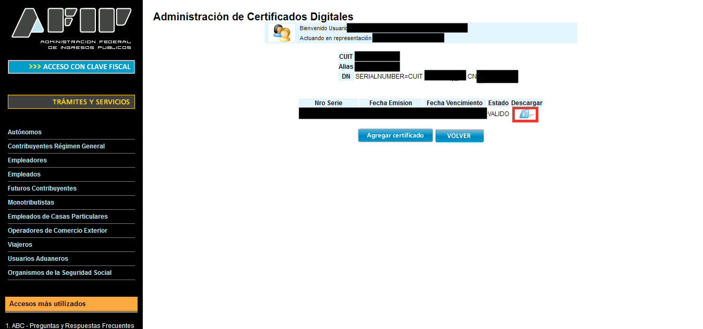

El CSR ya no es necesario después de este paso, podés borrarlo.

### 3. Autorizar el servicio web

En producción esto se hace desde el **Administrador de Relaciones**, no desde WSASS.
Elegí **"Nueva Relación"** y presioná **"Buscar"** junto a Servicio:

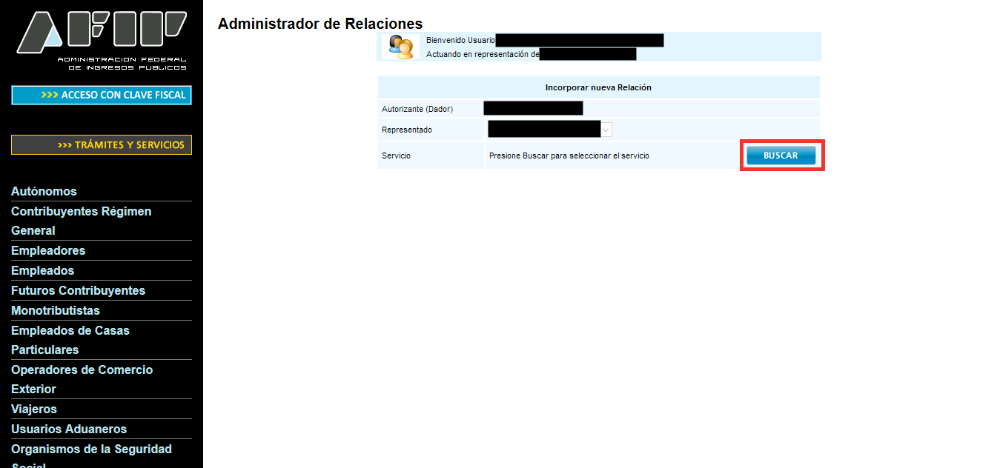

Navegá a **ARCA → Web Services** y elegí el servicio que necesitás (ej. `wsfe`):

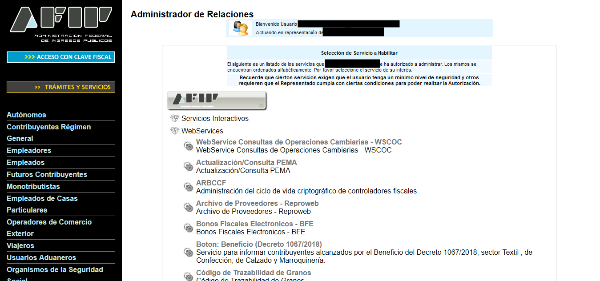

Presioná **"Buscar"** junto a Representante:

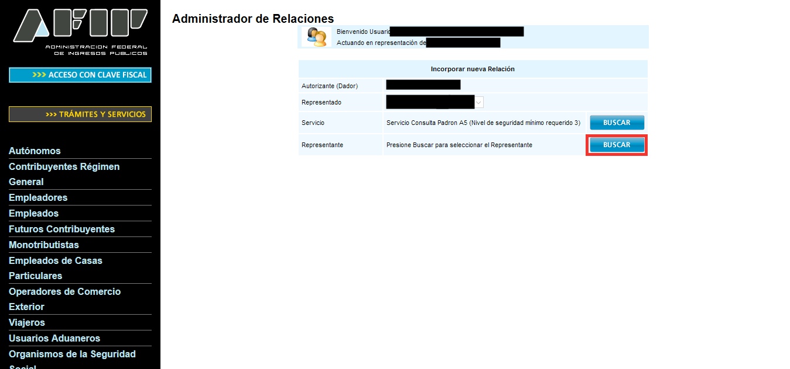

Elegí el **Computador Fiscal** asociado a tu certificado y confirmá:

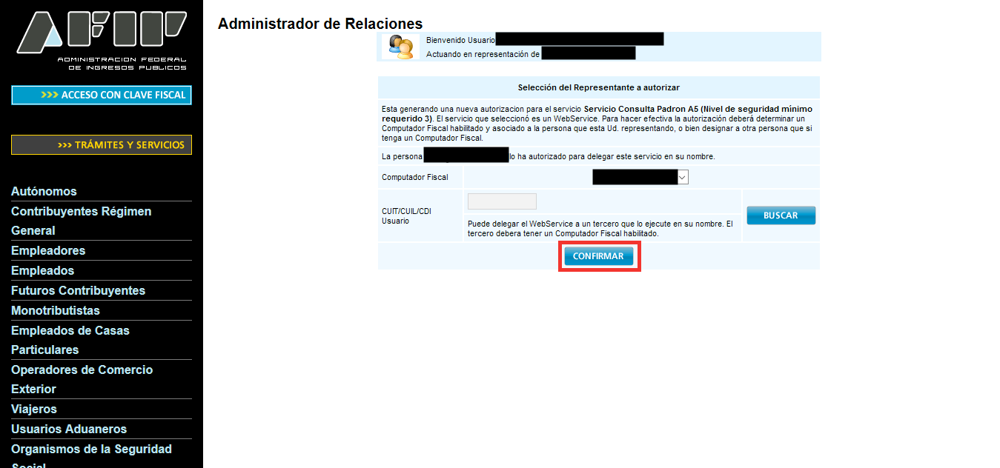

Por último, confirmá la relación completa:

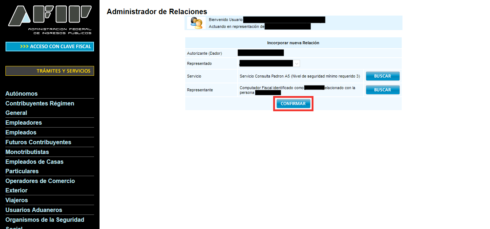

### 4. Configurar arcli

```bash
arcli config establecer cert.produccion /ruta/a/produccion.crt
arcli config establecer key.produccion /ruta/a/produccion.key
arcli config revisar --produccion
```

Para emitir de verdad en producción hace falta además `--produccion --emitir` en el
comando de facturación — ver [Seguridad: testing vs producción](../README.md#seguridad-testing-vs-producción).

---

## Fuentes

Tutoriales originales de afipts.com en los que se basa esta guía:

- [Habilitar certificados de testing](https://www.afipts.com/tutorial/enable_testing_certificates.html)
- [Obtener certificado de testing](https://www.afipts.com/tutorial/obtain-testing-certificate.html)
- [Autorizar servicio web de testing](https://www.afipts.com/tutorial/authorize-test-web-service.html)
- [Habilitar administrador de certificados de producción](https://www.afipts.com/tutorial/enable-production-certificate-manager.html)
- [Obtener certificado de producción](https://www.afipts.com/tutorial/obtain-production-certificate.html)
- [Autorizar servicio web de producción](https://www.afipts.com/tutorial/authorize-web-production-service.html)
